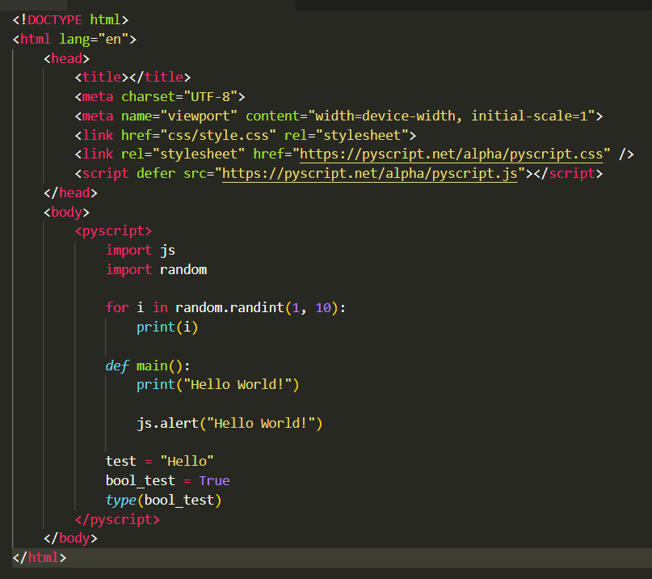

# PyScript extension for Visual Studio Code

> Beautiful syntax and scoped snippets for pyscript




## Features
- Provides code Highlighting for python langage in pyscript in HTML files.
- More than 200 snippets for PyScript, Django Templte, Python and HTML.
- Snippets are scoped to the current file.
- New Language Support for `pyscript` in VS code Language selection.


## Example Snippets
`pyscript` will add the following snippets:
```
<py-script>
</py-script>
```

`pycdn` will add the following snippets:
```
<link rel="stylesheet" href="https://pyscript.net/alpha/pyscript.css">
<script defer src="https://pyscript.net/alpha/pyscript.js"></script>"
```


